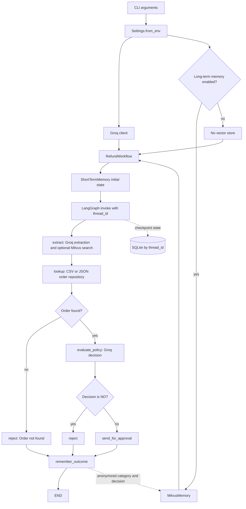

# Refund Agent: Complete Flow and Code Guide

This guide explains the current source tree from a developer's point of
view. It follows a request from the command line through Groq, order lookup,
LangGraph routing, SQLite checkpointing, and optional Milvus retrieval. It also
explains the Python constructs and the responsibility of each class/function.

## 1. What the Application Does

The program does not issue a refund. It:

1. Reads an email and refund policy from command-line arguments.
2. Asks Groq to extract structured details from the email.
3. Looks up the extracted order ID in a CSV or JSON order file.
4. Asks Groq to evaluate the verified order against the supplied policy.
5. Rejects a missing order or a policy decision of `NO`. `YES` and `NOT SURE`
   both go to the human-review placeholder.
6. Optionally retrieves and records anonymized category/decision examples in
   Milvus.

The LLM returns a recommendation, not an authoritative transaction. The
approval handler currently prints the case; it does not contact a payment
provider or issue a refund.

## 2. End-to-End Flow



The app has two separate persistence mechanisms:

- SQLite stores LangGraph checkpoints, including request state.
- Milvus stores vectors for short, anonymized historical labels. The current
  `remember_outcome` node does not store the raw email.

## 3. Java-to-Python Translation

| Python construct | Approximate Java concept | Important difference |
| --- | --- | --- |
| `package.module` / `import` | Java package and `import` | Python executes a module once per process and caches the module object. |
| `class Thing:` | `class Thing {}` | No `new` keyword; call `Thing(...)` to construct it. |
| `self` | `this` | Python passes the instance explicitly as the first instance-method argument. |
| `def f(x: str) -> int:` | typed Java method | Annotations help tools/libraries; Python does not enforce most types at runtime. |
| `str`, `int`, `Path` | `String`, `int`, `Path` | Python is dynamically typed; annotations are not Java compile-time checks. |
| `str | None` | `@Nullable String` / `Optional<String>` | The value may be a string or `None`. |
| `Literal["YES", "NO"]` | enum-like restricted values | Pydantic enforces this when validating a model; it is not a Java enum class. |
| `TypedDict` | typed map/DTO declaration | Describes dictionary keys for type checkers; it does not validate at runtime. |
| `dict[str, Any]` | `Map<String, Object>` | `Any` weakens static checking for values in that dictionary. |
| `@dataclass` | Java record / generated value class | Generates common methods such as `__init__`, but does not validate field types. |
| Pydantic `BaseModel` | DTO plus validation library | Parses and validates data at runtime. |
| `with resource:` | try/finally / try-with-resources | Calls `__enter__` and `__exit__` automatically. |
| `lambda x: ...` | lambda expression | Creates a small callable, often used as a callback/strategy. |
| `f"{value}"` | string interpolation | Expressions in braces are evaluated when the string is built. |
| `value or fallback` | null/default check | Uses truthiness, so empty strings/lists also select the fallback. |
| `if __name__ == "__main__":` | Java `main` launch guard | Runs only when launched directly as a script/module, not on ordinary import. |

Python does not require Java-style interfaces for dependency injection. The
workflow accepts objects with the methods it calls; this is duck typing. A fake
object with compatible methods can replace the Groq adapter in a test.

## 4. Starting the Program

The console script is declared in [pyproject.toml](../pyproject.toml):

```toml
[project.scripts]
refund-agent = "refund_agent.cli:main"
```

The package installer creates a `refund-agent` executable that imports
`refund_agent.cli` and calls `main()`. This project uses a `src/` layout, so an
editable install (`pip install -e .`) makes the package importable while still
using source from the working tree.

The two Python entry points are:

- [__main__.py](../src/refund_agent/__main__.py) supports
  `python -m refund_agent`.
- [refund_langgraph.py](../refund_langgraph.py) is a compatibility script that
  also calls the CLI `main()`.

Both use Python's standard launch guard. Importing the file does not start a
request; launching it does.

## 5. CLI and Resource Construction

See [cli.py](../src/refund_agent/cli.py).

### Imports

The standard-library imports provide argument parsing, dates, and filesystem
paths. The other imports are project classes: workflow, settings, Groq adapter,
Milvus adapter, and SQLite adapter. Importing a name does not construct its
client; client construction happens inside `main()`.

### `main()` statement by statement

1. `ArgumentParser(...)` creates a parser for command-line arguments, similar
   to a small CLI framework or a configured Java parser.
2. `--email` and `--policy` are required options. If missing, argparse prints
   usage and exits before clients are created.
3. `--thread-id` defaults to `refund-cli`. Use a distinct, stable ID per
   conversation because the checkpointer uses it to separate histories.
4. `type=date.fromisoformat` converts an optional `YYYY-MM-DD` string to a
   `datetime.date`. Invalid dates fail while parsing CLI arguments.
5. `type=Path` converts `--orders` text to a filesystem `Path` object.
6. `parse_args()` reads `sys.argv` and returns an object with fields such as
   `args.email` and `args.thread_id`.
7. `Settings.from_env()` loads configuration and raises if `GROQ_API_KEY` is
   missing.
8. `RefundLanguageModel(...)` constructs a Groq SDK client for this run.
9. `long_term_memory = None` represents a disabled/absent adapter. If enabled,
   `MilvusMemory(...)` connects, initializes FastEmbed, and creates the target
   collection when absent.
10. `try/finally` guarantees the optional Milvus client is closed if execution
    raises.
11. `with SessionMemory(...) as session_memory` opens SQLite. Python calls
    `__enter__` on entry and `__exit__` on exit, even if an exception occurs.
12. `RefundWorkflow(...)` receives resources through dependency injection; it
    does not create its own vendor/database clients.
13. `args.orders or settings.orders_file` chooses the CLI path if supplied,
    otherwise the configured default path.
14. `workflow.run(...)` starts one graph invocation.
15. The CLI prints `status` and an optional `reason` from the final state.
16. The `finally` block closes Milvus; the `with` block independently closes
    SQLite.

## 6. Configuration: `Settings`

See [infrastructure/config.py](../src/refund_agent/infrastructure/config.py).

### `PROJECT_ROOT`

`Path(__file__).resolve()` gets the absolute path of `config.py`. `parents[3]`
walks from `infrastructure/` to `refund_agent/`, then `src/`, then the
repository root. Relative file paths therefore resolve from the project root,
not the shell's current directory.

### `@dataclass(frozen=True)` and fields

`Settings` is an immutable configuration value object. `dataclass` generates
the initializer and common methods, much like a Java record. `frozen=True`
prevents reassignment after construction; it is not deep immutability.

The fields hold the Groq key/model, order and SQLite paths, a boolean for
long-term memory, and Milvus connection/collection values. `str | None` means a
token may be `None` when local Milvus does not require authentication.

### `Settings.from_env()`

This class method is called as `Settings.from_env()`, not on an existing
instance. It:

1. Calls `load_dotenv()`: this loads `.env`, not `.env.example`. Existing process
   environment values normally take precedence over `.env` values.
2. Reads `GROQ_API_KEY` and raises `ValueError` if it is absent/empty. Other
   fields have defaults.
3. Reads optional values with `os.getenv(name, default)`.
4. Converts paths with `_project_path` and the boolean with `_as_bool`.
5. Converts an empty Milvus token to `None` with `or None`.
6. Returns a new `Settings` object.

Defaults in source are `data/orders.csv`,
`data/refund_sessions.sqlite3`, `false` for long-term memory,
`http://localhost:19530`, and collection `refund_memories`. Local `.env` values
may override them.

### `_project_path(value)`

`Path(value).expanduser()` expands a leading `~`. Absolute paths are returned
unchanged; relative paths are joined to `PROJECT_ROOT`.

### `_as_bool(value)`

The string is stripped and lowercased. Only `1`, `true`, `yes`, and `on` become
`True`. Any other string becomes `False`; for example, `"enabled"` is false.

## 7. Domain Models and Graph State

See [domain/models.py](../src/refund_agent/domain/models.py).

### `EmailDetails(BaseModel)`

This Pydantic model represents details extracted from the email:

- `category: Literal[...]` permits exactly `refund`, `shipping`, `complaint`,
  or `other`.
- `order_number: str | None = None` is optional and defaults to `None`.
- `amount: float | None = None` is optional; missing amount does not fail this
  schema.
- `order_date: date | None = None` is parsed into a date object when present.

Pydantic validates when code calls `model_validate_json`. This is closer to
deserializing into a DTO with validation annotations than a plain POJO.

### `RefundPolicyResult(BaseModel)`

Requires a decision exactly equal to `YES`, `NO`, or `NOT SURE`, plus a string
reason. Missing or invalid values raise a validation error.

### `RefundState(TypedDict, total=False)`

Describes the keys allowed in the graph's shared dictionary. `total=False` means
every key is optional to the type checker because nodes return partial updates.
It is not runtime validation: it remains a normal dictionary, and code must
ensure required keys exist before indexing them.

`TypedDict` is therefore different from Pydantic `BaseModel`: the former
describes dictionary shape for static tools; the latter validates objects at
runtime.

## 8. `RefundWorkflow`: Graph Definition and Execution

See [application/workflow.py](../src/refund_agent/application/workflow.py).

### Constructor

`__init__` receives a language model, order path, SQLite checkpointer wrapper,
optional Milvus adapter, and optional approval callback. The
`Callable[[dict[str, Any]], None]` annotation means the callback accepts one
dictionary and has no useful return value. `approval_handler or
self._print_approval` chooses the supplied callback, or the default printer.
Finally, `_build_graph()` compiles the workflow once and stores it as
`self.graph`.

### `run(...)`

Creates a `ShortTermMemory` for this request. If `evaluation_date` is absent,
`date.today()` supplies the local system date. `as_state()` converts the value
object into the initial graph dictionary.

`graph.invoke(initial_state, config=...)` executes synchronously. The nested
`configurable.thread_id` is how LangGraph associates checkpoints with a
conversation. Reusing an ID reuses that thread; unrelated conversations need
different IDs.

### Graph nodes

Nested node functions close over `self`, so they use injected adapters without
putting service clients into graph state. A node returns a partial dictionary;
LangGraph merges those keys into the shared state.

#### `extract(state)`

1. Calls Groq with `state["email_body"]`.
2. Builds a Milvus query from extracted category and current policy. Raw email
   text is not included in that retrieval query.
3. Searches Milvus if configured; otherwise uses an empty list.
4. Returns extracted fields and `related_memories`.

`model_dump(mode="json")` converts the Pydantic object to JSON-compatible
values, including serializing dates, which helps graph checkpointing.

#### `lookup(state)`

Loads records from the configured file and searches by extracted order number.
It returns `{"order": order}`; a missing order is represented as `None`.

#### `evaluate_policy(state)`

Runs only after the lookup branch confirms an order exists. It sends the
verified order, policy, date, and retrieved examples to Groq. `state["order"] or
{}` substitutes an empty dictionary for a falsy order value. The Pydantic
result is converted to a plain dictionary for graph state.

#### `send_for_approval(state)`

Calls the injected handler with order and policy result, then returns
`PENDING_HUMAN_APPROVAL`. The default handler only prints; it does not send an
approval request or issue a refund.

#### `reject(state)`

If order is missing, returns `REJECTED` with `Order not found`. Otherwise it
returns `REJECTED` with the model's reason or a fallback. `state.get(...)`
avoids a `KeyError` for an optional key.

#### `remember_outcome(state)`

If Milvus is enabled and a policy result exists, it adds a short text with only
category and decision. Metadata contains category, decision, and a UUID. It
does not write an outcome for a missing order because there is no policy result.

The UUID in metadata is different from the integer primary key generated inside
`MilvusMemory.add()`.

### Routers

`route_after_lookup` returns `reject` if `order is None`, else
`evaluate_policy`. `Literal[...]` documents legal string results to the type
checker.

`route_after_policy` rejects only exact `NO`. Both `YES` and `NOT SURE` are
sent for human review. Uncertainty is not treated as approval or rejection.

### Graph builder and edges

`StateGraph(RefundState)` creates a graph with that state shape.
`add_node(name, function)` registers nodes. `START` and `END` are LangGraph
sentinel nodes.

- `START -> extract -> lookup` is fixed.
- `lookup` branches through `route_after_lookup`.
- `evaluate_policy` branches through `route_after_policy`.
- both outcome paths flow through `remember_outcome`.
- `remember_outcome -> END` finishes execution.

`compile(checkpointer=...)` builds the runnable graph and attaches SQLite
checkpointing. It does not call Groq or process an email by itself.

## 9. Groq Adapter: `RefundLanguageModel`

See [infrastructure/llm.py](../src/refund_agent/infrastructure/llm.py).

### Constructor

`Groq(api_key=...)` creates the SDK client. The class stores the selected model
name so both operations use the same model. This code does not print the key.

### `extract_email_details(email_body)`

Builds a prompt asking for category, order number, amount, and date, instructs
the model not to infer missing values, and requests JSON. It delegates to
`_complete_json(prompt, EmailDetails)`, which returns a validated Pydantic
object.

### `evaluate_refund(...)`

Formats retrieved examples as bullet lines, or `None` if there are none.
`json.dumps(order, default=str)` serializes the verified order; `default=str`
converts unsupported values to strings. The prompt says current verified order
and policy are authoritative, with history only as context. It delegates to
`_complete_json(..., RefundPolicyResult)`.

### `_complete_json(prompt, schema)`

1. Calls `chat.completions.create` with a user message, temperature zero, and
   JSON-object response mode.
2. Reads the first choice's message content.
3. Raises `ValueError` if content is empty.
4. Calls `schema.model_validate_json(content)` to parse and validate.

`schema` is a class, not an instance. Temperature zero reduces variation but
does not guarantee factual correctness or perfectly deterministic output.
Network/API and Pydantic errors currently propagate to the caller.

## 10. Order Repository Functions

See [infrastructure/orders.py](../src/refund_agent/infrastructure/orders.py).

### `load_orders(file_path)`

1. Raises `FileNotFoundError` if the path is not a file.
2. Uses the lowercased suffix to select CSV or JSON handling.
3. `csv.DictReader` treats the header row as keys and returns one dictionary per
   data row. CSV values remain strings unless explicitly converted.
4. `json.load` reads JSON. A non-list root value raises `ValueError`.
5. Unsupported suffixes raise `ValueError` rather than silently returning an
   empty result.

This is a repository/adapter boundary: the workflow consumes the same
list-of-dictionaries shape regardless of source format.

### `find_order_by_id(orders, order_id)`

An empty ID returns `None`. Otherwise `next(generator, None)` returns the first
record whose stringified `order_id` matches. It is a linear search, $O(n)$, not
an indexed database query.

## 11. The Three Memory Classes

### `ShortTermMemory`

See [memory/short_term.py](../src/refund_agent/memory/short_term.py).

`@dataclass(frozen=True)` defines an immutable per-request value object holding
email, policy, and evaluation date. `as_state()` returns a new dictionary for
LangGraph's initial state. The value object itself is not persisted; LangGraph
can persist graph state through its configured checkpointer.

### `SessionMemory`

See [memory/session.py](../src/refund_agent/memory/session.py).

1. `mkdir(parents=True, exist_ok=True)` creates the database's parent directory
   if needed.
2. `sqlite3.connect(..., check_same_thread=False)` opens/creates the SQLite
   file. The flag permits cross-thread use; it does not guarantee every
   concurrent-write pattern is safe.
3. `SqliteSaver(connection)` adapts SQLite to LangGraph's checkpointer protocol.
4. `setup()` initializes the checkpointer tables.
5. `close()` closes the underlying connection.
6. `__enter__` and `__exit__` implement Python's context manager, so a `with`
   statement closes the connection even if an exception occurs.

The graph's `thread_id` separates checkpointed conversations. Checkpoint state
can include email and order details; protect and expire the SQLite file
according to your retention rules.

### `MilvusMemory`

See [memory/long_term.py](../src/refund_agent/memory/long_term.py).

#### Constructor

1. `MilvusClient(uri, token)` creates the database client. The token can be
   `None` for the current unauthenticated local instance.
2. `TextEmbedding(...)` initializes FastEmbed using
   `sentence-transformers/all-MiniLM-L6-v2`. First use may download model files.
3. `embed(["dimension probe"])` returns vector(s); `next(...)` gets the first
   vector and `len(...)` measures its dimension. The tested model produces 384
   dimensions.
4. `has_collection` checks the configured name. If missing, `create_collection`
   makes it with cosine similarity and dynamic fields.

`refund_memories` is this app's collection name, separate from other collections
in the same Milvus instance.

#### `add(text, metadata)`

FastEmbed converts text into a numeric vector. The client inserts a row with an
integer primary key, vector, text, and metadata. The ID expression masks a
random UUID integer to a non-negative 63-bit number for a signed 64-bit key.
The explicit `id` is required by the collection schema used by this app.

#### `search(query, limit)`

Embeds the query with the same model and asks Milvus for the nearest vectors.
The collection uses cosine similarity. `limit` bounds the number of hits, and
`output_fields=["text"]` retrieves the source text. The list comprehension
flattens result groups and excludes hits without text.

#### `close()`

Closes the Milvus client connection. The CLI calls this from `finally`.

## 12. Policy Helper and Compatibility Modules

### `parse_refund_rules`

[domain/policy.py](../src/refund_agent/domain/policy.py) splits numbered text
like `1. First rule. 2. Second rule.`. The regular expression recognizes a
number followed by a period and whitespace. A generator filters empty split
segments; `enumerate(..., start=1)` assigns rule names.

Important: `RefundWorkflow` does **not** call this helper today. The raw policy
string is sent directly to `RefundLanguageModel.evaluate_refund()`. The helper
is unit-tested but is not part of the active graph path.

### Package `__init__.py` files

These mark directories as Python packages. The root exports a version string.
The memory package re-exports `ShortTermMemory` in `__all__`; that list controls
wildcard imports and some documentation tooling. The workflow imports memory
classes from their concrete modules. Other package initializers are markers.

### `refund_agent.workflow`

[workflow.py](../src/refund_agent/workflow.py) re-exports
`RefundWorkflow` from `application.workflow` for backward compatibility. It
contains no duplicate graph implementation.

## 13. Tests and Their Limits

[tests/test_orders.py](../tests/test_orders.py) tests CSV loading, JSON loading,
order lookup, unsupported file types, and numbered policy parsing.
`tmp_path` is pytest's temporary directory fixture, so these tests do not modify
the committed order data.

[tests/test_memory.py](../tests/test_memory.py) checks that
`ShortTermMemory.as_state()` has the expected request values.

These unit tests do not call Groq or Milvus and do not test graph routing. A
local integration smoke test exercised the graph using a fake LLM and temporary
SQLite/Milvus stores. A real request additionally needs valid Groq credentials,
network access, a currently available model, and an explicit correct policy.

## 14. Debugging Checklist

1. **CLI parsing:** run `refund-agent --help` to check installation and options.
2. **Settings:** verify key names and paths without printing key values.
   `Settings.from_env()` requires `GROQ_API_KEY`.
3. **Extraction:** inspect validated `EmailDetails`; a wrong/missing order ID
   leads to a failed lookup.
4. **Lookup:** confirm the configured path, CSV headers, and exact `order_id`.
   CSV cell values are strings.
5. **Routing:** missing order rejects; policy `NO` rejects; `YES` and `NOT SURE`
   go to the approval handler.
6. **Checkpoints:** reuse a `thread_id` for the same conversation. Verify
   `SESSION_DB` if persistence seems wrong.
7. **RAG:** check Milvus URI/auth/collection. First initialization can be slow
   because FastEmbed may download the model.

Keep LangSmith tracing off unless you intentionally want workflow inputs and
outputs sent to LangSmith. Never commit `.env` or put live customer emails in
test fixtures.